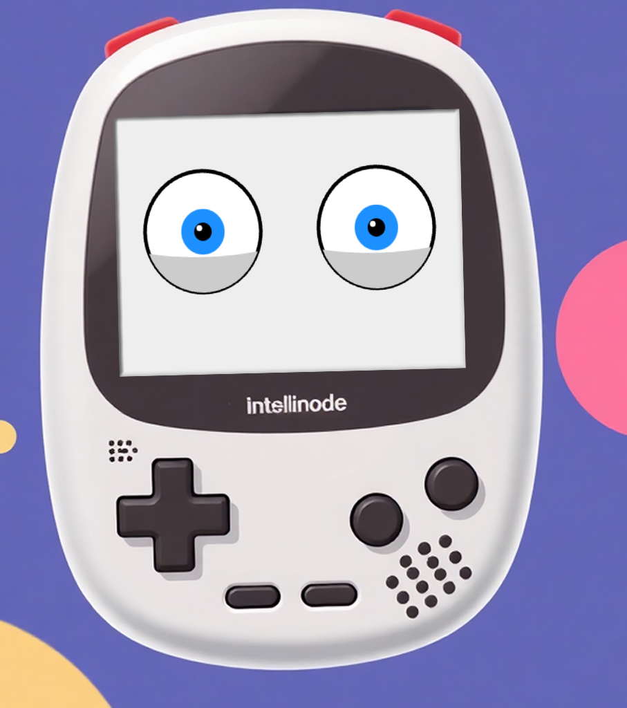
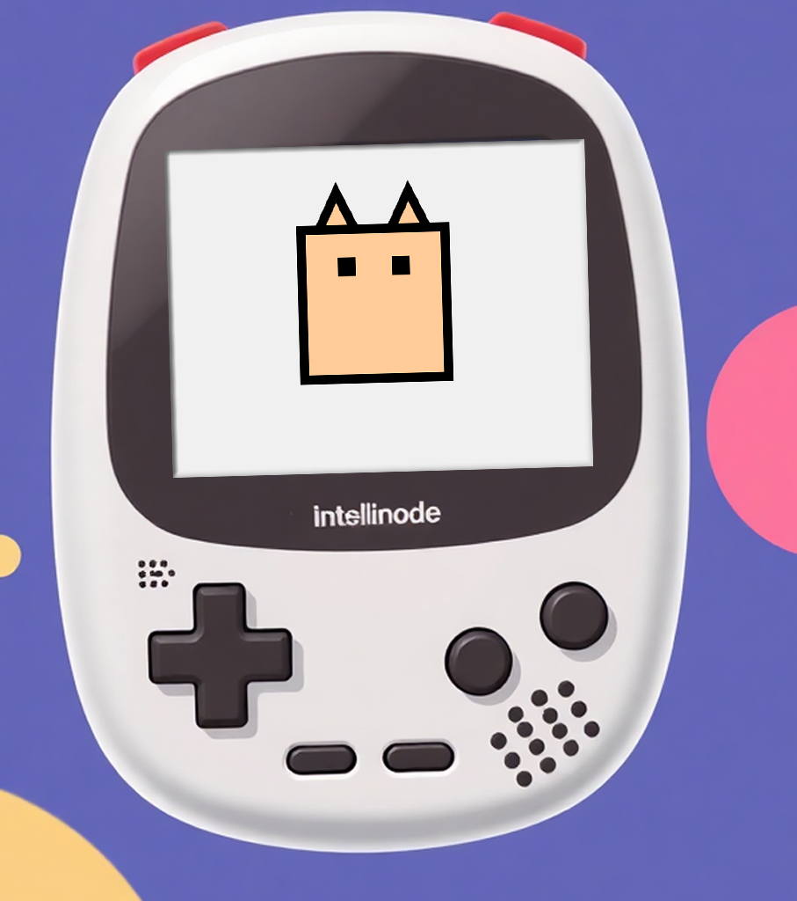
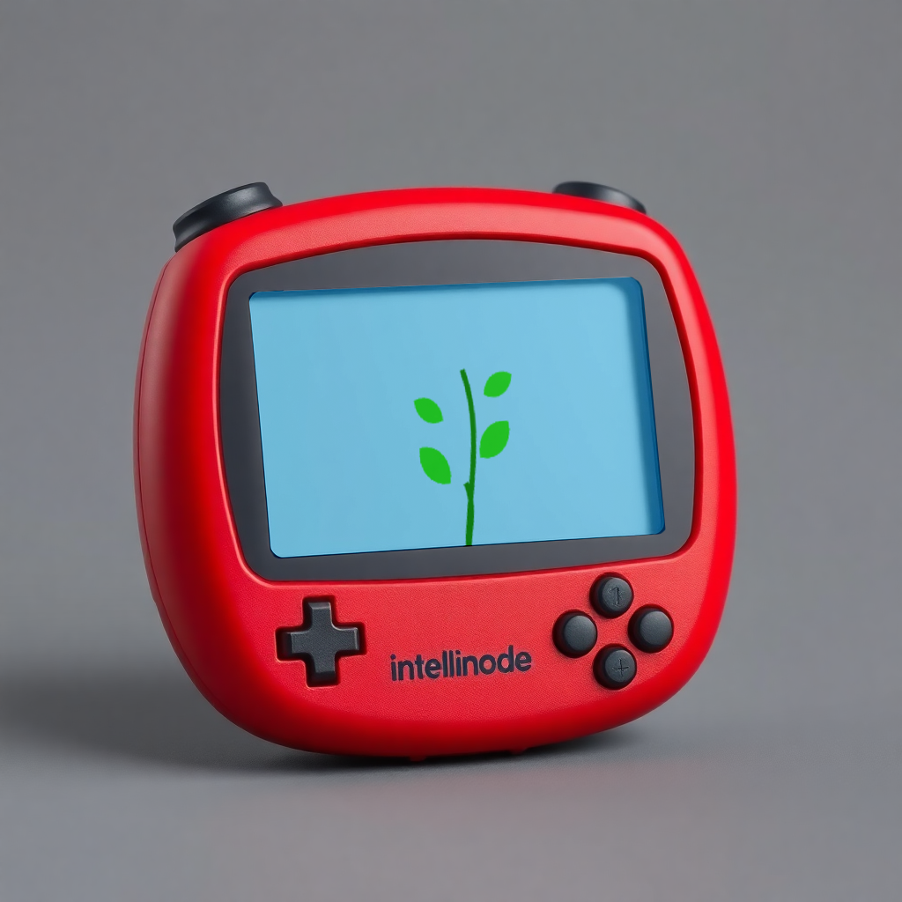

# Tamagotchi

This project is inspired by the classic Tamagotchi device, featuring a virtual character drawn with JavaScript. The character can be controlled through various buttons, or it can dynamically change based on interactions with an AI assistant.

## How to Use:

1. **Manual Mode**: Click on the buttons to perform actions.
2. **AI-Controlled Mode**: Connect this with an AI assistant to automatically update the character.

Feel free to customize the project, or expand it for AI assistant interaction.

## Characters:

### Eyes

### Cat

## Plant
